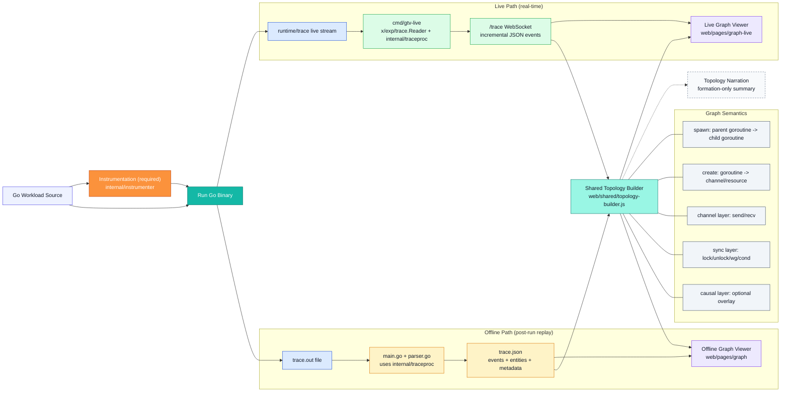

# Go Trace Visualizer (GTV)

GTV visualizes Go concurrency from `runtime/trace` in two modes:

- Live replay over WebSocket
- Offline replay from `trace.json`

It includes an instrumenter, a shared trace processor, and two graph viewers with synchronization-aware topology.

## Current Pipeline



## What Is Current

- Web UI lives under `web/pages/*` (not the legacy flat `web/*.html` paths).
- Synchronization is first-class in topology (`sync` layer), separate from channel transport.
- Topology edges use stronger IDs (`seq`/`time_ns` aware) to avoid link collapsing.
- Offline and live viewers both support:
  - `Sync only`
  - optional layer filters (`Channel/Sync/Spawn/Causal`)
  - topology narration panel (`Compact` / `Normal` + copy)
- Instrument flow supports loading generated workloads directly from `internal/workload`.

## Quick Start

### Live (recommended)

1. Start server:

```bash
go run ./cmd/gtv-live
```

2. Open:

- `http://localhost:8080/` (redirects to start page)
- direct: `http://localhost:8080/pages/index/index.html`

3. Use **Start** (`/pages/instrument/instrument.html`):

- Create workload from source, or **Load Workload** from `internal/workload`
- Run once or open live graph

4. Live graph:

- `http://localhost:8080/pages/graph-live/graph-live.html`

### Offline

1. Generate trace files:

```bash
go run .
```

Outputs: `trace.out`, `trace.json`

2. Open offline graph:

- `http://localhost:8080/pages/graph/graph.html`
- then load `trace.json` if needed

## Core URLs and APIs

### Pages

- Start: `/pages/index/index.html`
- Instrument: `/pages/instrument/instrument.html`
- Offline viewer: `/pages/graph/graph.html`
- Live viewer: `/pages/graph-live/graph-live.html`
- Demo page: `/pages/demo/demo.html`

### Server endpoints

- `GET /trace` (WebSocket): live event stream
- `POST /instrument`: instrument source into generated workload
- `GET /workloads`: list generated workloads in `internal/workload`
- `GET /workload?name=<workload>`: fetch generated workload source
- `GET /run?...`: run workload once and return timeline JSON
- `GET /demo/go-trace`: open Go native trace flow
- `POST /clear-build-cache`: clear runner build cache

## Instrumentation Workflows

### Browser instrument flow

From `/pages/instrument/instrument.html`:

- **Create Workload** sends source to `/instrument`
- Generated file is written to `internal/workload/<name>_gen.go`
- **Load Workload** queries `/workloads` and `/workload`, always from `internal/workload`

### CLI instrument flow

```bash
go run ./cmd/gtv-instrument -in ./your_main.go -name MyWork
```

Important flags:

- `-outdir` (default `internal/workload`)
- `-level tasks_only|regions|regions_logs` (default `regions`)
- `-sync-validation` (enforces sync preset)
- `-block-regions`, `-goroutine-regions`, `-guard-labels`
- `-value-logs`
- `-io-regions`, `-io-json`, `-io-db`
- `-http-tasks`, `-grpc-tasks`, `-loop-regions`

### Sync validation preset

When sync validation is enabled (UI preset or CLI `-sync-validation`):

- level forced to `regions_logs`
- block regions forced on
- goroutine regions forced on
- guarded labels forced on

This is enforced in both the server-side `/instrument` path and CLI path.

## Topology and Synchronization Model

### Layer contract

Topology links carry `layer`:

- `channel`
- `sync`
- `spawn`
- `causal`

`kind` is still present for style/backward compatibility.

### Semantic edge rules

- `create`: `main -> channel`
- `spawn`: `parent goroutine -> child goroutine`

### Sync events remain explicit

Parser/normalization preserves sync events such as:

- `mutex_lock`, `mutex_unlock`
- `rwmutex_lock`, `rwmutex_unlock`, `rwmutex_rlock`, `rwmutex_runlock`
- `wg_add`, `wg_done`, `wg_wait`
- `cond_wait`, `cond_signal`, `cond_broadcast`

They are not flattened into generic channel `send/recv` semantics.

## Viewer Features

### Live viewer (`/pages/graph-live/graph-live.html`)

- Event mode: `teach` / `debug`
- `Sync View` preset button for sync debugging
- Toggles: `Commits`, `Attempts`, `Causal`, `Messages only`, `Sync only`
- Optional layer filter group (query `?layers=1` or `?layer_filters=1`)
- `Run HUD`, `Debug / Audit`, `Download Events`
- Topology narration panel: **Topology** button (`Compact`/`Normal`, copy)
- Event buffer cap (default 12,000) with topology retained

### Offline viewer (`/pages/graph/graph.html`)

- Event list with `Topology build` vs `All events`
- Display/Layout/Interaction grouped controls
- `Sync only` + optional layer filters
- `Debug / Audit`
- Topology narration panel (`Compact`/`Normal`, copy)

## Sync Debug Validation Mode

Recommended live settings while diagnosing synchronization:

- `Events = debug`
- `Messages only = off`
- `Causal = on`
- `Commits = on`
- `Attempts = on` only when pairing ambiguity needs inspection

Fast path:

- Instrument page: click **Sync Capture Preset**
- Live page: click **Sync View**

## Runtime Ordering Contract

- `time_ns` is the authoritative trace timestamp.
- `seq` is the authoritative live arrival order index assigned by `cmd/gtv-live`.

## Key Flags and Environment Variables

### `cmd/gtv-live`

Flags:

- `-addr` (default from `GTV_ADDR`, else `:8080`)
- `-workload`
- `-bc-mode`
- `-mode teach|debug`
- `-timeout` (also propagates to child as `GTV_TIMEOUT_MS`)
- `-synth`
- `-drop-block-no-ch`
- `-live-log`
- `-mvp`

Env highlights:

- `GTV_ADDR`
- `GTV_WORKLOAD`
- `GTV_BC_MODE`
- `GTV_MODE`
- `GTV_TIMEOUT`
- `GTV_SYNTH_SEND`
- `GTV_DROP_BLOCK_NO_CH`
- `GTV_LIVE_LOG`
- `GTV_MVP`

### Trace processor (`internal/traceproc`)

- `GTV_FILTER_GOROUTINES=ops|all|legacy`
- `GTV_SKIP_PAIRING_CHANNELS`
- `GTV_QUIESCENCE_MS`
- `GTV_DEADLOCK_WINDOW_MS`
- `GTV_BLOCK_INFER_MS`
- `GTV_SELECT_FALLBACK`

### Instrumenter (`internal/instrumenter`)

- `GTV_INSTR_LEVEL`
- `GTV_INSTR_GUARD_LABELS`
- `GTV_INSTR_GOROUTINE_REGIONS`
- `GTV_INSTR_BLOCK_REGIONS`
- `GTV_INSTR_HTTP_TASKS`
- `GTV_INSTR_GRPC_TASKS`
- `GTV_INSTR_LOOP_REGIONS`
- `GTV_LOG_VALUES`
- `GTV_INSTR_IO_REGIONS`
- `GTV_INSTR_IO_JSON`
- `GTV_INSTR_IO_DB`
- `GTV_INSTR_IO_HTTP`
- `GTV_INSTR_IO_OS`
- `GTV_INSTR_IO_ASSUME_BG`
- `GTV_INSTR_CONFIG`
- `GTV_MVP`

## Repo Layout (current)

- `cmd/gtv-live/main.go` — HTTP/WebSocket live server
- `cmd/gtv-instrument/main.go` — CLI instrumenter
- `cmd/gtv-runner` — workload runner entrypoint
- `internal/traceproc/traceproc.go` — shared trace -> timeline processor
- `internal/instrumenter/*` — source instrumentation pipeline
- `internal/workload/*` — built-in + generated workloads
- `main.go` + `parser.go` — offline run + `trace.out` -> `trace.json`
- `web/pages/*` — UI pages
- `web/shared/*` — shared frontend topology/render helpers + tests

## Testing

Useful checks used during recent sync/topology changes:

```bash
node web/shared/topology-builder.test.mjs
node web/shared/topology-description.test.mjs
node web/shared/viewer-layer-utils.test.mjs
node web/shared/viewer-renderer-integration.test.mjs

go test ./internal/traceproc ./internal/instrumenter
```

## Troubleshooting

- Live page disconnected:
  - ensure server is running and page is served over `http://localhost:8080/...`
- No generated workload listed in Instrument page:
  - verify file exists under `internal/workload/*_gen.go`
  - check `/workloads` response
- Missing sync edges in viewer:
  - use sync preset (`regions_logs` + block regions)
  - switch live to `Events=debug`
  - keep `Messages only` off

## Notes

- `GTV_MVP=1` keeps UI and instrumentation in a reduced, classroom-friendly configuration.
- Value logs are optional and can increase trace volume.
- For non-terminating runs, timeout/signal hooks flush traces (`GTV_TIMEOUT_MS` supported by runner/instrumented workloads).
